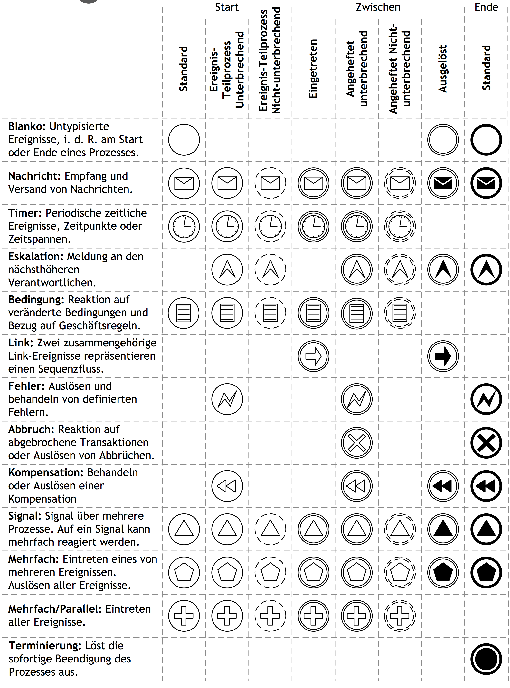

# Analytische Modelle
----
## Events

+++

----
### neu in Level 2 <br/	> Intermediate Events

Note:
bisher
Start - löst Prozess aus
Ende - beendet einen Prozess

+++

#### Throwing

	

* schwarzes Symbol
* Prozess _erzeugt_ ein Ereignis
* treten sofort und automatisch ein
* nicht alle Typen möglich

+++
#### Catching

	

* weißes Symbol
* Prozess _erwartet_ ein Ereignis
* von den meisten Ergeignissen unterstützt
  * aber nicht von allen

+++
#### Boundary Intermediate Events

	

* am Rande einer Aktivität
* keine eingehende Kante
* Prozess hört auf Ereignis
  * nur _während der Ausführung_ der Aktivität

+++
##### unterbrechend

	

beendet die Aktivität sofort

+++
##### nicht-unterbrechend

	

+++

----
### weitere Event-Typen

+++
#### Escalation Event

	

Note:
* nicht spezifiziert, was das Ereignis triggert
* nur das es getriggert wird

+++
#### Signal

	

* Unterschied zu Message
	* global
	* keine Korrelation

+++
#### Error Event

	

Note:
* Parent-Level unterscheidung
* Error Event beendet Prozess

+++
#### Conditional Event

	

* feuert, sobald Bedingung erfüllt
* Beschriftung!

+++
#### Link-Ereingis

	

* beliebig viele throws-Ereignisse

----
### Event-Subprocess

----
## Nachrichten

### Event-Gateway

### Message-Boundary-Events

### Nachrichten in Pools

### Asynchrones Messaging

----

## Iterationen und Instanzen

### Schleifen

+++
### Multi-Instance-Aktivität

+++
### Synchronisierung

+++
### Batch-Verarbeitung

----

## Splitting und Merging

----

## Transaktionen
----
## Palette
### eCH-0158

* Schweizer Standard der öffentl. Verwaltung
* Ziel
	* Vereinheitlichung der Modellierungsoptionen (d.h. Freiheitsgrade) des BPMN-Standards

* adressiert Prozessverantwortliche, Prozessmanager und Unternehmensarchitekten

+++
### eCH-0158

  <object width="100%" height="100%" type="application/pdf" data="/attachments/eCH-0158_V1.1.pdf">
    
Insert your error message here, if the PDF cannot be displayed.

  </object>

